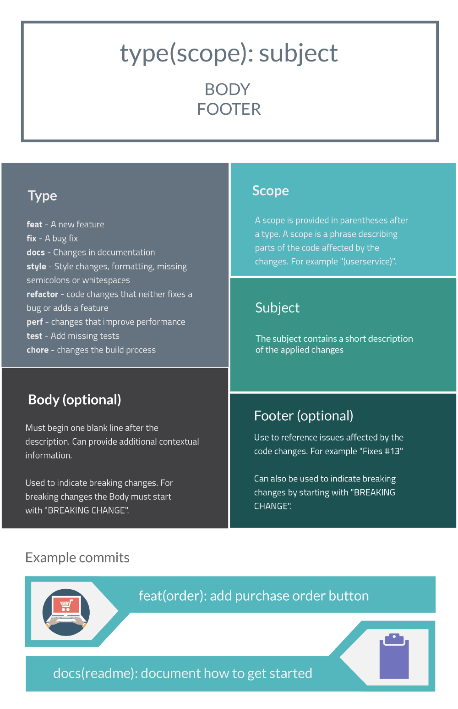

# Design Doc

## Basic Architecture

Subject to change.

Some details regarding wether we'll be using sockets or not for the frontend will be decided later. But its mostly leaning against NO. It was only added here coz it was there last time.

## Life Cycle of a component

So for each component the following things will happen.

1. The page will load in the frontend using the react router (frontend)
2. The components sends a request to the backend in equal intervals.
3. The backend node server receives the request on a certain route and communicates with the chip using the modbus protocol as necessary.
4. The backend node server sends back a response.
5. The frontend parses the response.
6. The frontend updates all the necessary views based on the data and current page.

## Work Assignment

Like we discussed, first we ll make a doc listing all the fuctions requried and the inputs, outputs, description, owner etc. And we ll work on them. Please take a look at the guidelines before working. For any other doubts contact me directly.  Work will be assigned in [link](https://docs.google.com/spreadsheets/d/1x2Nz0RtNkf-k6_KUXr8Ht5l5V0QjCEHh-0cQRxbPjrY/edit?usp=sharing)

# Doubts regarding Design Doc

1. Change channels in realtime Trend.
2. Change the half of sensors in pages which show only half sensors.
3. Mimic screen number of sensors mismatch.
4. Resources such as Icons.
5. Any device specifications like rate limits.

# Guideline

I call it guidelines because you dont actually need to follow them strictly, honestly you dont need to at all, coz although these are good practices, they arent followed at all in corporate world. Atleast they are followed only by some departments even in big tech gaints. But its is good to know them.

## 1 Git workflow

So we will be using github extensively in the course of a few weeks. So here i ll just let you know how we ll work with git.

* First clone the mian repo into your system.
* Any local files that you don'd want to commit, add it to .gitignore. .env files are always supposed to be added in gitignore
* Then create a branch for you to work on, so choosing the amount of stuff to work on in a single commit is a tough job, but its upto you. you could make a commit for every function you make, but i think for UI it would be better if you work on all the functions and UI related to a component and then commit that as one it would work well.
* So once you are done with your work, commit it.
* Now pull code from remote.
* If there are commits on main after you started working, then you have to rebase your branch. So you can do that by checking out your feature branch and then 'git rebase main' and then commiting it. This basicallly puts your changes in the end of the git tree. Now push your branch to remote
* if there arent any commits  on main then you can just push your branch to remote.
* After this we ll check the changes and merge it togethor.

## 2 Recommended Tools

Download the following vscode extensions for making your dev life easier

1. REST Client or Thunder client for api testing
2. ES7+ React/Redux/React-Native snippets for react snippets ike creating a new component
3. Git graph to understand git commits and branches
4. Office Viewer (Markdown Editor) for viewing all kinds of files like png, exel, pdf, markdown, etc
5. Colorful comments recommended if you like to color code your comments

## 3 Folder Structure

There is no real requirement of a specific folder structure for react, but it really really helps to manage dir structure. This is a general struture which seems good to follow:

* /src/routes/page/
  * page.js
  * page.css
  * components/
    * componant_name.js
    * component_name.css
* /src/helper/
  * Component/

## 4 css classnames

Always start the class names witht he component names so as to avoid repeating same names in other files.

## 5 Git commit messages

Write your messages using this as a guide

## Simplified Details of Design

### 1 Home Page

A page th

### 2 Bar Graph

Bar graph from live data

x-axis sensor number (1-40) with address 200-239

y-axis db level read from the register 40-120

### 3 Frequency Spectrum

Bar Graph of frequency spectrum of each sensor's decibel level.

x-axis frequency 1-12kHz with 32 bands of red and green

y-axis db level 40-120 dB

To get the frequency sprectrum of required sensor, set tag #9 to sensor number.

Then read the db values for green bar from tag 14-45 (33 bands) and read the db values for red bar from tag 146-177(32 bands)

Read current chanel number from tag 9.

Current overall DB from tag 11

### 4 Realtime Trend

A line graph from groups of 10 sensor values based on previous values.

x-axis time different intervals

y-axis db value 40-120

get live db values from 200-239

### 5 Mimic screen

db Values represented in a actual general location of sensor

get db values from 200-239

### 6 Sensor Profile

Same as last screen with additional data being represented from the different bits from different registers.

### 7 Sensor settings

refer requirement.pdf

### 8 System Settings

refer requirement.pdf

### 9 Sensor Status

refer requirement.pdf

### 10 Alarm popup

### 11 Help screen popup
